# Home Work
____
### Сделать сценарий с перечисленными эндпоинтами
#### Дать нагрузку на 250 потоков.
#### 1. http://162.55.220.72:5005/get_method
req.
GET
name: str
age: int
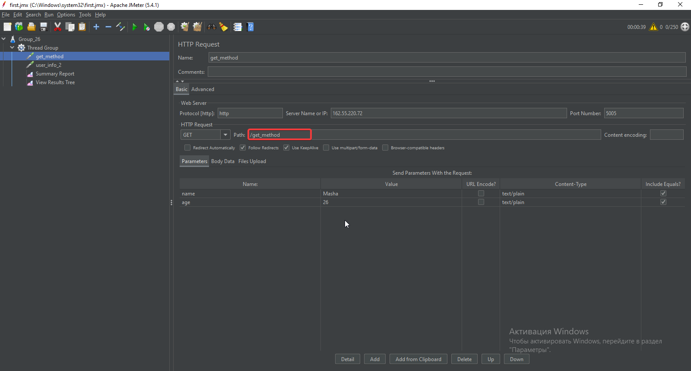
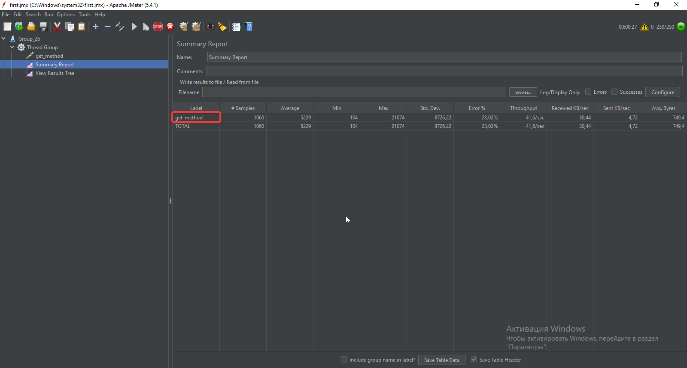

#### 2. http://162.55.220.72:5005/user_info_2
req.
POST
name: str
age: int
salary: int
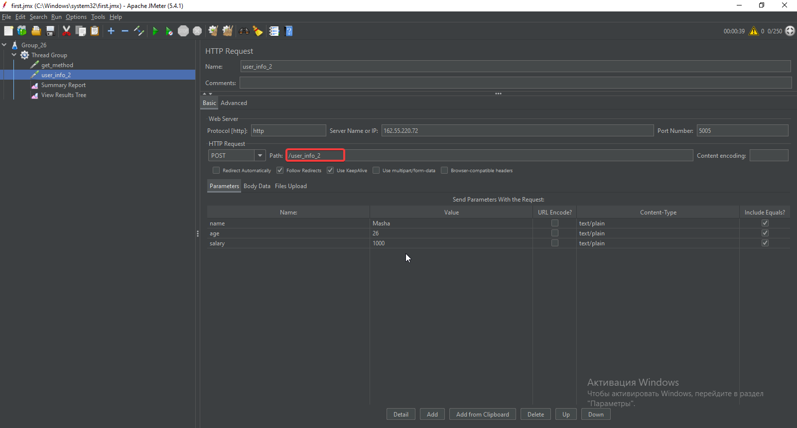
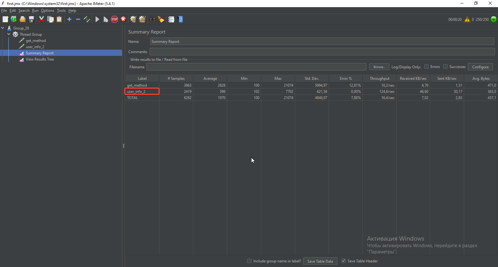

#### 3. http://162.55.220.72:5005/user_info_3
req.
POST
name: str
age: int
salary: int
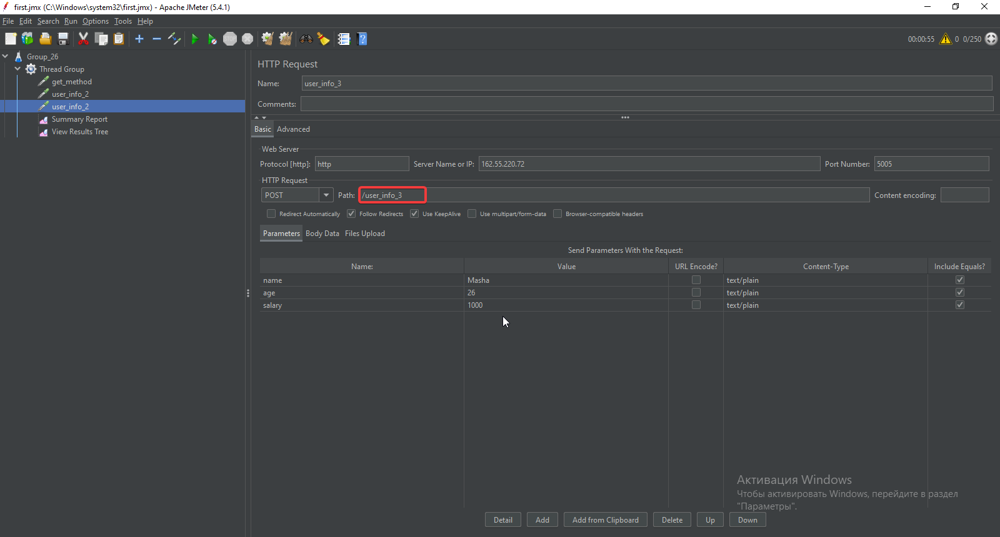
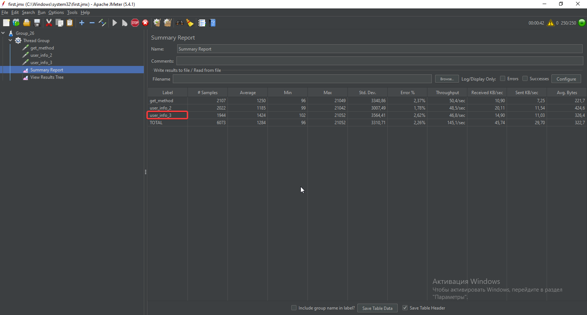

#### 4. http://162.55.220.72:5005/object_info_1
req.
GET
name: str
age: int
weight: int
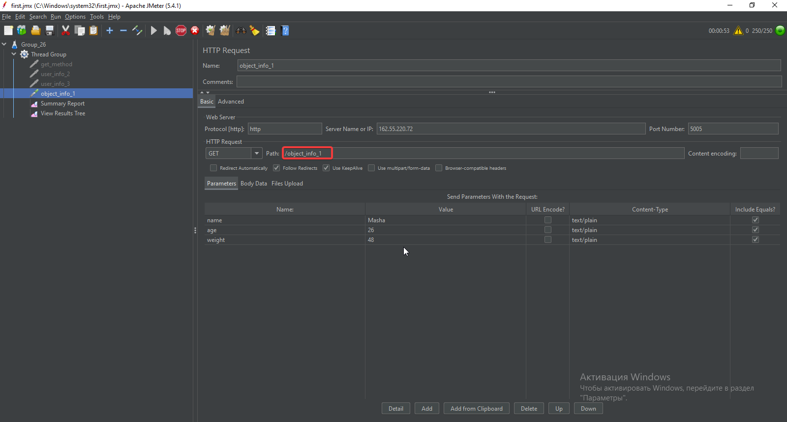
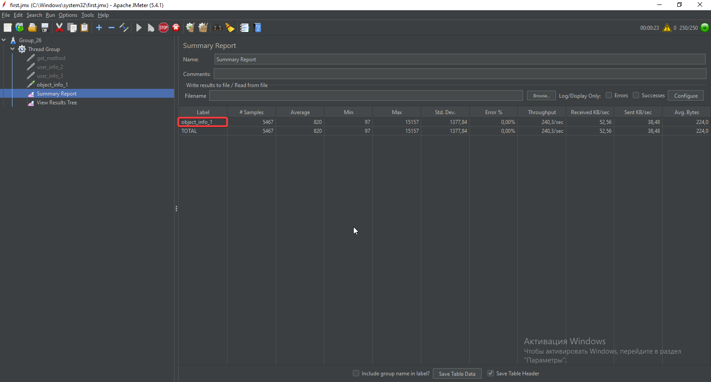

#### 5. http://162.55.220.72:5005/object_info_2
req.
GET
name: str
age: int
salary: int
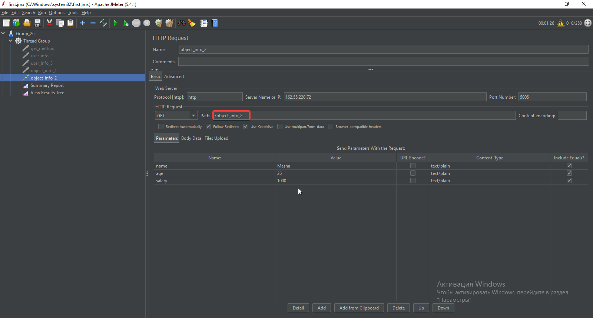
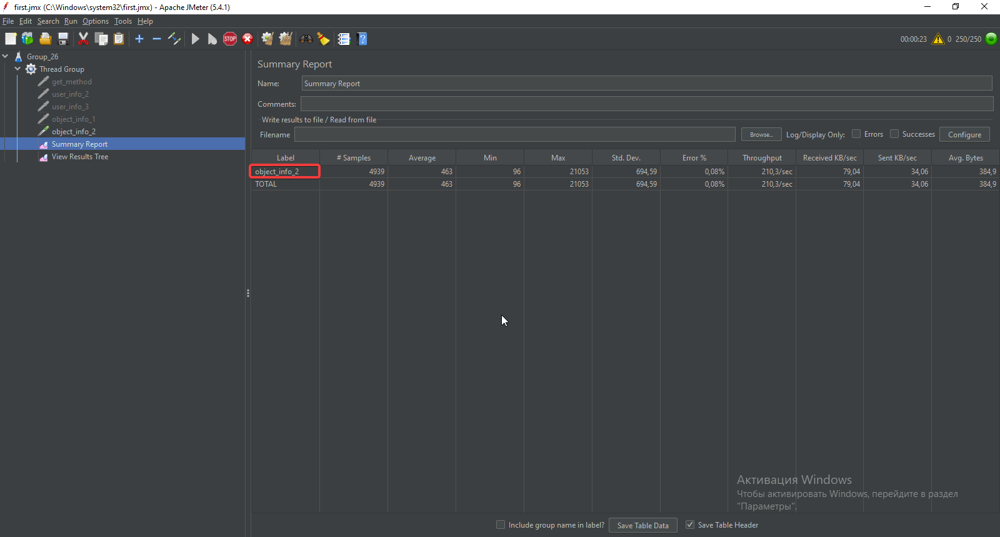

#### 6. http://162.55.220.72:5005/object_info_3
req.
GET
name: str
age: int
salary: int
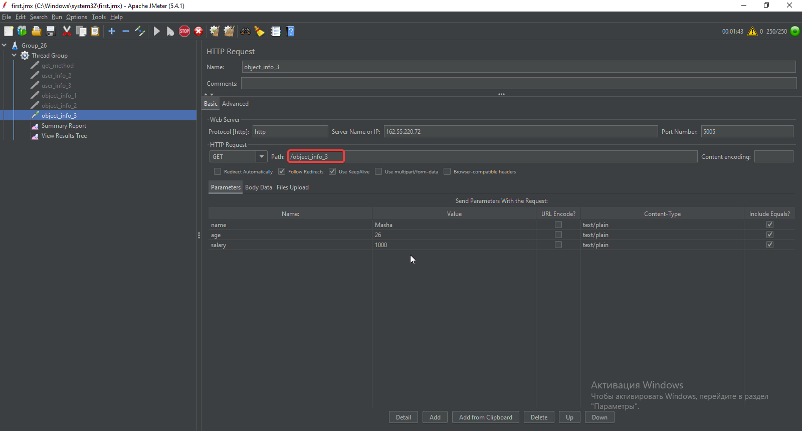
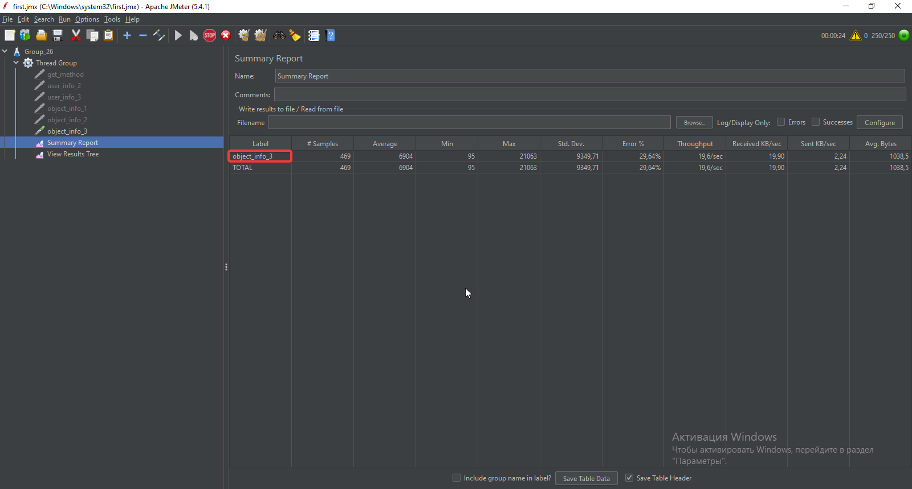

#### 7. http://162.55.220.72:5005/object_info_4
req.
GET
name: str
age: int
salary: int
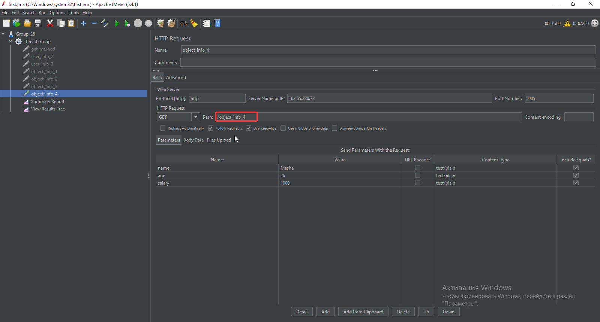
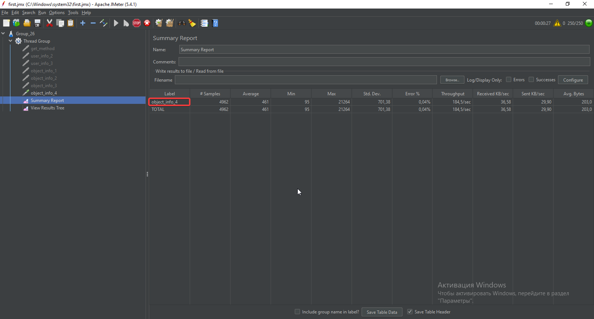
